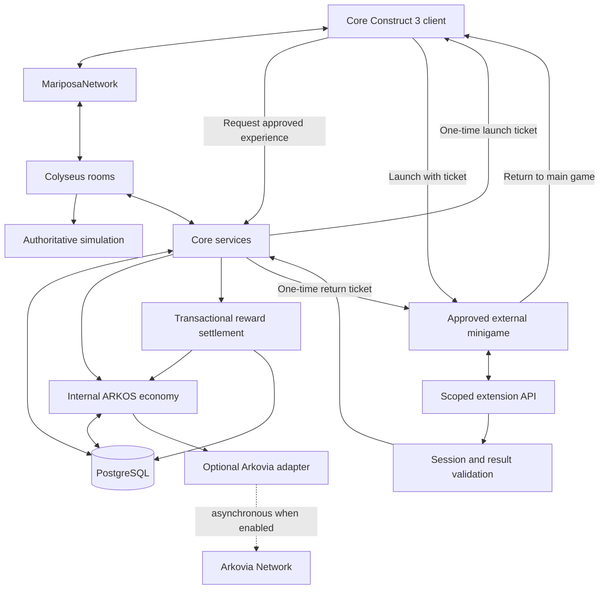

# Mariposa Universe Server

[](https://github.com/mycreationhaven/Mariposa-Universe-Server/actions/workflows/ci.yml)
[](https://nodejs.org/)
[](https://www.typescriptlang.org/)
[](https://www.construct.net/)
[](https://colyseus.io/)

The authoritative multiplayer and backend foundation for **Mariposa Universe**, a downloadable, family-friendly 2D side-scrolling platformer/MMORPG created with **Construct 3**.

The first working milestone allows two or more players to connect to a shared test zone, receive server-issued development identities, move left and right, jump, fall, land, observe one another through synchronized state, and disconnect cleanly. The client sends input intentions; the server calculates the result.

> **Current stage:** Multiplayer foundation / pre-alpha. This repository is functional development infrastructure, not a complete game or production-ready public service.

## Project vision

Mariposa Universe is planned as a persistent, welcoming online world with exploration, platforming, towns, regions, quests, character customization, NPC lives, crafting, housing, businesses, player commerce, seasonal festivals, optional creator-made experiences, and an ARKOS-powered internal economy.

Planned desktop platforms include:

- Windows
- macOS
- Linux
- SteamOS and Steam Deck
- Steam as a long-term distribution target

Construct 3 remains the game client. This project does not use Godot, Unity, Unreal, or a browser-authoritative peer-to-peer model.

## What works now

- Node.js 22 and strict TypeScript server
- Colyseus WebSocket multiplayer room
- Shared `development_test_zone`
- Server-issued temporary development player identities
- PostgreSQL-backed account registration and login
- Argon2id password hashing
- Short-lived signed access tokens and rotating hashed refresh sessions
- Refresh-token replay revocation and idempotent logout
- Authenticated room joins and a 20-second reconnect window
- Deterministic latency, jitter, packet-loss, and outage tests
- Real WebSocket authentication, hostile-payload, and reconnection tests
- Local-player visual correction smoothing with a safety snap threshold
- Configurable multi-client load and soak runner
- Server-authoritative horizontal movement
- Server-authoritative jumping, gravity, falling, and landing
- Maximum speed, room boundaries, and floor collision
- Player spawn and despawn synchronization
- Monotonic input sequences and stale-input rejection
- Strict input schema validation and unknown-field rejection
- Per-session input rate limiting
- Structured, redacted server logging
- Health endpoint and graceful shutdown
- Construct 3 networking abstraction
- Remote-player snapshot interpolation example
- PostgreSQL schema and generated Drizzle migration
- Internal ARKOS economy interfaces and idempotency proof
- Seasonal session/result/reward security interfaces
- Steam-safe platform capability enforcement
- Initial world, zone, instance, inventory, and NPC boundaries
- Automated tests and GitHub Actions CI

## First multiplayer demonstration

The included simulation proves the current milestone:

1. Player A and Player B connect to the server.
2. Both join `development_test_zone`.
3. Player A sends right/jump input intentions.
4. The server validates and simulates Player A.
5. Player B receives Player A's authoritative state.
6. Player A disconnects.
7. Player B observes Player A being removed.

The client never submits an authoritative position.

## Architecture



The server begins as a modular monolith. It has meaningful internal boundaries without prematurely dividing the prototype into dozens of network services.

Solid flows are core or authoritative. The Arkovia connection is optional and asynchronous. The core server returns a one-time launch ticket to the core client, which then launches the approved external minigame. Results return through the scoped API for validation and transactional settlement before the server issues a safe return ticket.

The world model is designed around:

```text
World → Region → Zone → Instance
```

This allows future locations such as Bellweather Town or Aurelian Forest to have multiple instances without treating the entire MMORPG as one enormous room.

### Add-ons, minigames, plugins, mods, and seasonal gameplay

Mariposa Universe is designed to accept optional experiences without embedding every event into the core Construct 3 project. Different extension types use different controlled paths; they are not all network clients and are not all plugins.

The planned extension categories include:

- Seasonal festivals and temporary zones
- Separate Construct 3 minigames
- Platforming challenges, races, puzzles, and cooperative games
- Seasonal NPCs, quests, decorations, and objectives
- Approved server plugins that use documented service interfaces
- Approved content mods made against versioned data schemas
- Future Creator SDK experiences built without access to the core `.c3p`

Every add-on will require a registered manifest containing its expansion ID, developer ID, version, API version, minimum game version, requested permissions, active dates, permitted endpoints, checksum/signature, and approval status.

Native seasonal zones run through normal core rooms and services. External Construct 3 minigames use one-time launch tickets and a scoped extension API. Data-only mods are imported through validation tooling rather than calling runtime APIs. Trusted backend plugins are installed by operators and use internal versioned interfaces; they are never arbitrary player-supplied code.

External add-ons may submit events, scores, or completion claims. They may **not** directly change ARKOS, inventory, experience, accounts, core NPC state, marketplace data, or administrative privileges. The core server validates the session and result, prevents duplicate claims, determines the approved reward, settles it transactionally, and issues a safe return transfer to the main game.

## Authority model

The Construct 3 client is untrusted. It sends controls and requests; the backend makes authoritative decisions.

The server owns or will own:

- Position and velocity
- Movement and collision
- Health and player statistics
- Authentication and sessions
- Inventory, equipment, and item ownership
- Experience and quest progress
- NPC and persistent world state
- ARKOS balances and transaction history
- Rewards and seasonal claims
- Marketplace and player-trade settlement
- Administrative privileges

No database credentials, signing keys, private wallet keys, treasury keys, or authoritative secrets belong in Construct 3.

## Technology stack

| Area                  | Technology            | Purpose                                                       |
| --------------------- | --------------------- | ------------------------------------------------------------- |
| Game client           | Construct 3           | Downloadable 2D game and presentation layer                   |
| Client integration    | JavaScript            | Isolated Mariposa networking bridge                           |
| Runtime               | Node.js 22+           | Multiplayer/backend process                                   |
| Server language       | TypeScript            | Strict, maintainable server code                              |
| Real-time networking  | Colyseus + WebSockets | Rooms, connections, and state synchronization                 |
| Validation            | Zod                   | Strict configuration and message validation                   |
| Persistence           | PostgreSQL            | Transactional authoritative data                              |
| Database layer        | Drizzle ORM/Kit       | Typed schema and migrations                                   |
| Logging               | Pino                  | Structured server logs with redaction                         |
| Optional coordination | Redis                 | Future presence, pub/sub, matchmaking, and distributed limits |
| Testing               | Vitest                | Unit and security-invariant tests                             |
| Automation            | GitHub Actions        | Lint, typecheck, tests, and build on changes                  |

## Repository structure

```text
Mariposa-Universe-Server/
├── client/
│   └── construct3/          # Construct-specific networking bridge
├── docs/                    # Architecture, security, protocol, and roadmap
├── drizzle/                 # Generated PostgreSQL migration files
├── scripts/                 # Migration, seed, and multiplayer simulation scripts
├── src/
│   ├── auth/                # Development identity boundary
│   ├── config/              # Validated environment configuration
│   ├── database/            # Drizzle schema and database client
│   ├── economy/             # ARKOS-neutral ledger contracts and proof service
│   ├── inventory/           # Authoritative inventory contracts
│   ├── logging/             # Structured redacted logging
│   ├── movement/            # Deterministic authoritative movement
│   ├── networking/          # Network protocol schemas and types
│   ├── npcs/                # Future persistent NPC boundary
│   ├── platform/            # Steam/direct-download capability policy
│   ├── rooms/               # Colyseus room and synchronized state
│   ├── seasonal/            # Seasonal session and reward-claim boundary
│   ├── security/            # Input protection and rate limiting
│   └── world/               # World/region/zone/instance contracts
├── tests/                   # Automated tests
├── .env.example             # Safe configuration template
├── docker-compose.yml       # PostgreSQL and optional Redis
└── package.json             # Commands and dependencies
```

## Requirements

- Node.js 22 or newer
- npm
- Docker Desktop or Docker Engine with Compose for local PostgreSQL
- Construct 3 for the visual game-client integration

## Local development setup

Clone the repository:

```bash
git clone https://github.com/mycreationhaven/Mariposa-Universe-Server.git
cd Mariposa-Universe-Server
```

Install dependencies:

```bash
npm install
```

Create local configuration:

```bash
cp .env.example .env
```

Replace the example `JWT_SECRET` and `SESSION_SECRET` values with separate random strings containing at least 32 characters. Never commit `.env`.

Start PostgreSQL:

```bash
docker compose up -d postgres
```

Generate and apply migrations:

```bash
npm run db:generate
npm run db:migrate
```

Optionally seed one development user and character:

```bash
npm run db:seed
```

Start the development server:

```bash
npm run dev
```

The default endpoints are:

- WebSocket/matchmaking server: `ws://localhost:2567`
- Health check: `http://localhost:2567/health`
- Test room name: `development_test_zone`

Production-style authentication endpoints are `POST /auth/register`, `POST /auth/login`, `POST /auth/refresh`, and `POST /auth/logout`. The non-persistent `POST /auth/development` helper remains available outside production for the test layout and simulator.

## Test multiplayer without Construct 3

With the server running, open another terminal and run:

```bash
npm run simulate
```

The script connects two real Colyseus clients, moves Player A, confirms that Player B receives Player A's authoritative state, disconnects Player A, and verifies room cleanup.

Run the focused network and hostile-client suite with:

```bash
npm run test:network
```

This exercises deterministic latency/jitter/loss simulation plus real Colyseus WebSocket authentication, authoritative input rejection, dropped connections, retained seats, and same-session reconnection.

Run a local multi-client load test against a running development server with:

```bash
MARIPOSA_LOAD_CLIENTS=20 MARIPOSA_LOAD_SECONDS=30 npm run load:local
```

Optional `MARIPOSA_LOAD_RAMP_MS` controls the delay between client joins. The runner reports connection failures, rooms used, input messages, observed state changes, and p50/p95/maximum join latency. Increase client counts gradually and monitor the server separately; this is an engineering tool, not a claim of production capacity.

## Quality commands

```bash
npm run lint
npm run typecheck
npm test
npm run build
```

Run the complete local quality gate:

```bash
npm run lint && npm run typecheck && npm test && npm run build
```

## Construct 3 integration

The networking implementation is intentionally isolated:

```text
Construct 3
    ↓
MariposaNetwork
    ↓
Colyseus
```

The bridge is located at:

```text
client/construct3/MariposaNetwork.js
```

Its current API includes:

- `Connect(endpoint)`
- `Register(email, password, displayName)`
- `Login(email, password)`
- `RefreshAuthentication()`
- `Logout()`
- `AuthenticateDevelopment(displayName)`
- `JoinZone(zone, options)`
- `ReconnectZone()`
- `SendInput(left, right, jump)`
- `Interact(targetId, action)`
- `Disconnect()`
- `IsConnected()`
- `GetLocalPlayer()`
- `GetRemotePlayers()`
- `GetInterpolatedRemotePlayers()`

The test-layout controller, remote sprite lifecycle, local prediction, authoritative reconciliation, authentication methods, and manual reconnection hook are included. See [`docs/CONSTRUCT_3_INTEGRATION.md`](docs/CONSTRUCT_3_INTEGRATION.md) and [`docs/MOVEMENT_AND_PREDICTION.md`](docs/MOVEMENT_AND_PREDICTION.md).

## Networking model

The client sends strict input states:

```json
{
  "sequence": 124,
  "left": false,
  "right": true,
  "jump": false,
  "clientTime": 4812.25
}
```

It does not send trusted coordinates. The server tracks the last processed sequence, simulates movement, and synchronizes:

- Player ID
- X/Y position
- Horizontal/vertical velocity
- Grounded state
- Facing direction
- Animation state
- Last processed input sequence
- Server tick

Remote players are rendered using buffered interpolation. The local player predicts immediately, then reconciles to authoritative snapshots and replays unacknowledged inputs.

## Database status

The initial PostgreSQL schema includes:

- Users
- Characters
- Player sessions
- Economy accounts
- Economy transactions
- Seasonal sessions
- Seasonal claims
- Audit logs

Future migrations will add item definitions, item instances, inventories, statistics, quests, achievements, relationships, housing, businesses, NPC persistence, and marketplace listings when their corresponding services become executable.

## ARKOS and Arkovia status

ARKOS gameplay functionality is deliberately separated from blockchain connectivity:

```text
Mariposa Economy API
    ↓
Internal ARKOS Ledger
    ↓
Optional Arkovia Adapter
```

Implemented now:

- `IEconomyProvider` service boundary
- Integer atomic-unit amounts using `bigint`
- Append-oriented transaction model
- Transaction IDs and idempotency keys
- Duplicate-transaction protection tests
- Sender, recipient, type, description, and timestamps
- Optional `IBlockchainAdapter` boundary

Intentionally not implemented yet:

- Real ARKOS deposits or withdrawals
- Blockchain signing
- Treasury or wallet key custody
- Arkovia node communication
- Confirmation and reorganization processing
- Production marketplace settlement

The game continues to function when Arkovia is disabled or unavailable.

## Steam compatibility

Steam mode is designed to use an internal, server-side, non-transferable game-currency ledger with:

- No external wallet
- No blockchain deposits
- No blockchain withdrawals
- No token exchange
- No required blockchain functionality

The server refuses invalid capability combinations such as enabling Steam mode together with Arkovia or an external wallet. Backend policy—not hidden UI—enforces the separation.

## Seasonal experiences and future Creator SDK

Seasonal games submit claims; they never award authoritative items, experience, or ARKOS themselves.

The server is designed to verify:

- Event and expansion approval
- Active dates
- Player/session binding
- Session expiry
- Plausible scores and objectives
- Duplicate result submissions
- Duplicate reward claims
- Creator permissions
- Server-controlled reward mappings

Future approved creators will receive a limited SDK and separate sample Construct 3 project. They will not receive the core `.c3p`, core event sheets, server source, database credentials, signing keys, economy write access, or administrative APIs.

## Security status

Implemented foundations:

- Untrusted-client architecture
- Strict message schemas
- Server-issued development identities
- PostgreSQL-backed accounts and characters
- Argon2id password hashing
- Fifteen-minute signed access tokens
- Opaque rotating refresh tokens stored only as hashes
- Refresh-token replay revocation and logout
- Authenticated room joins and temporary reconnection
- Input sequence/replay protection
- Input rate limiting
- Movement and delta-time constraints
- Authoritative collision and boundaries
- Economy and seasonal idempotency tests
- Environment-based secrets
- Structured log redaction
- No secrets or database access in the client

Required before a public production launch:

- TLS and secure WebSockets
- Email verification and account recovery
- Multi-device session management
- Persistent reconnect recovery after application restart
- Distributed rate limiting
- Durable transactional economy service
- Administrative MFA and authorization controls
- Ban/suspension tooling
- Monitoring and alerting
- Backup and restoration drills
- Dependency, container, penetration, and load testing

Read the complete checklist in [`docs/SECURITY.md`](docs/SECURITY.md).

## Environment configuration

| Variable                   | Purpose                                   |
| -------------------------- | ----------------------------------------- |
| `NODE_ENV`                 | Runtime environment                       |
| `PORT`                     | HTTP/WebSocket listening port             |
| `DATABASE_URL`             | PostgreSQL connection string              |
| `REDIS_URL`                | Optional future Redis connection          |
| `JWT_SECRET`               | Access-token signing secret               |
| `SESSION_SECRET`           | Refresh-token hashing pepper              |
| `CORS_ALLOWED_ORIGINS`     | Approved client origins                   |
| `SERVER_TICK_RATE`         | Authoritative simulation rate             |
| `NETWORK_UPDATE_RATE`      | Desired state update rate                 |
| `LOG_LEVEL`                | Structured logging level                  |
| `ARKOVIA_ENABLED`          | Enables the future Arkovia adapter        |
| `STEAM_ENABLED`            | Applies Steam-safe platform rules         |
| `DIRECT_DOWNLOAD_ENABLED`  | Enables direct-download capability        |
| `EXTERNAL_WALLET_ENABLED`  | Enables future external-wallet capability |
| `SEASONAL_CONTENT_ENABLED` | Enables seasonal content capability       |

See [`.env.example`](.env.example) for safe local defaults.

## Documentation

- [`ARCHITECTURE.md`](docs/ARCHITECTURE.md) — system boundaries and scaling direction
- [`CONSTRUCT_3_INTEGRATION.md`](docs/CONSTRUCT_3_INTEGRATION.md) — client integration steps
- [`NETWORK_PROTOCOL.md`](docs/NETWORK_PROTOCOL.md) — messages and synchronized state
- [`MOVEMENT_AND_PREDICTION.md`](docs/MOVEMENT_AND_PREDICTION.md) — movement, interpolation, and reconciliation
- [`NETWORK_TESTING.md`](docs/NETWORK_TESTING.md) — latency, loss, hostile-client, and reconnect coverage
- [`DATABASE.md`](docs/DATABASE.md) — persistence and migration strategy
- [`ECONOMY_AND_ARKOS.md`](docs/ECONOMY_AND_ARKOS.md) — internal ledger and optional adapter
- [`SEASONAL_EXTENSION_SYSTEM.md`](docs/SEASONAL_EXTENSION_SYSTEM.md) — secure seasonal result flow
- [`CREATOR_SDK_FUTURE.md`](docs/CREATOR_SDK_FUTURE.md) — future third-party boundary
- [`SECURITY.md`](docs/SECURITY.md) — protections and production checklist
- [`STEAM_PLATFORM_SEPARATION.md`](docs/STEAM_PLATFORM_SEPARATION.md) — platform capability policy
- [`DEPLOYMENT.md`](docs/DEPLOYMENT.md) — Linux/VPS deployment direction
- [`ROADMAP.md`](docs/ROADMAP.md) — phased development plan
- [`DECISIONS.md`](docs/DECISIONS.md) — architecture decision records

## Development roadmap

### Completed foundation

- Repository and tooling
- Authoritative Colyseus room
- Multiplayer movement and state synchronization
- Construct 3 bridge foundation
- PostgreSQL schema and migrations
- Economy, seasonal, platform, world, NPC, and inventory boundaries
- Automated tests and CI
- Construct 3 test-layout controller
- Local prediction and authoritative reconciliation
- Persistent accounts and rotating authenticated sessions
- Temporary authenticated room reconnection
- Deterministic network-condition and live WebSocket integration tests
- Visual correction smoothing and configurable load/soak runner

### Next milestone

1. Assemble and visually validate the included test-layout controller in the Construct 3 editor.
2. Visually validate and tune the included correction smoothing in Construct 3.
3. Add email verification, account recovery, and user-facing session management.
4. Persist and restore the current zone and spawn state across longer disconnects.
5. Run longer multi-client soak and regional deployment tests on production-like infrastructure.

### Later milestones

- Server-owned platform collision maps
- Zone transfer and instance allocation
- Persistent inventory and character statistics
- NPC presence and schedules
- Quest and achievement services
- Transactional PostgreSQL ARKOS ledger
- Secure marketplace and player trading
- Seasonal registry and signed expansion manifests
- Multiple Colyseus workers and Redis coordination
- Approved Creator SDK pilot

## Production scaling direction

The planned growth path is:

1. One Node.js server and PostgreSQL
2. Multiple Colyseus workers with Redis coordination
3. Regional/world clusters with allocated zone ownership
4. Multiple geographic regions if population requires them

Redis is intentionally optional for the first milestone. It becomes appropriate when multiple processes need shared presence, pub/sub, matchmaking, room discovery, distributed rate limits, or cross-server coordination.

## Contributing

This project is in active early development. Before submitting changes:

1. Keep the Construct 3 client behind the Mariposa networking abstraction.
2. Never trust client coordinates, balances, items, rewards, identity, or privileges.
3. Do not make blockchain or Steam a core gameplay dependency.
4. Do not commit `.env`, credentials, keys, tokens, or private player data.
5. Add or update tests for behavioral and security changes.
6. Run the complete quality gate.
7. Update documentation when protocol or architecture behavior changes.

## License and usage

No open-source license has been declared for this repository yet. Until the owner adds one, the source remains under the repository owner's copyright and should not be assumed to grant redistribution, modification, or commercial-use rights.

## Project ownership

Mariposa Universe is a project of **My Creation Haven**.

Repository: [github.com/mycreationhaven/Mariposa-Universe-Server](https://github.com/mycreationhaven/Mariposa-Universe-Server)
