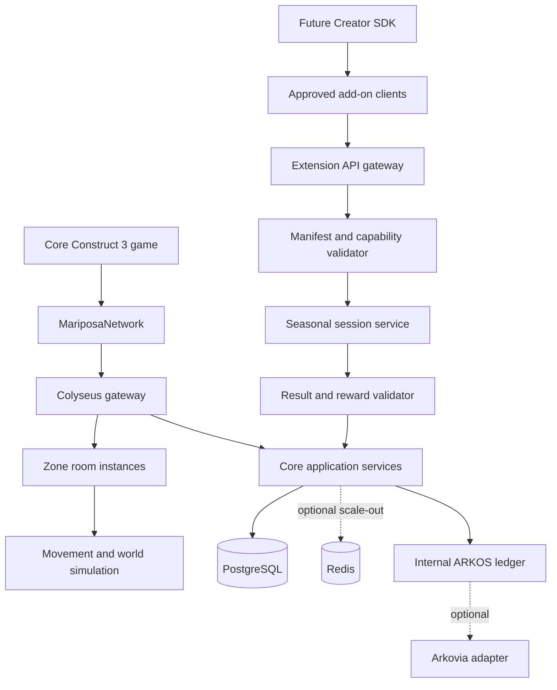
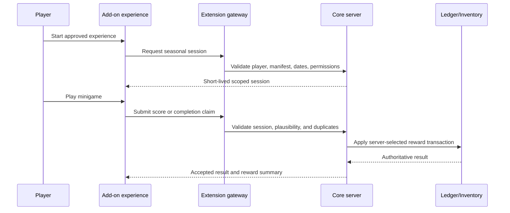

# Architecture

Mariposa Universe uses a server-authoritative modular architecture. The core game remains stable while approved minigames, seasonal experiences, plugins, mods, and future creator projects connect through controlled extension boundaries.

## Complete system view



The extension gateway is a security boundary. It is not a shortcut into core services.

## Core application

The application begins as a modular monolith. Real-time rooms, identity, world, economy, seasonal, inventory, NPC, database, security, and platform policy have explicit boundaries without premature networked microservices.

Core systems include:

- Authentication and player sessions
- World, region, zone, and instance management
- Authoritative movement and collision
- Player statistics, inventory, equipment, and quests
- Persistent NPCs and world state
- Internal ARKOS economy
- Marketplace and player trading
- Seasonal registry and reward validation
- Expansion registration and permissions
- Administrative policy and audit logs

## World and instance model

World addresses follow:

```text
World → Region → Zone → Instance
```

A `ZoneManager` owns zone metadata, an `InstanceAllocator` chooses a room, and `PlayerTransferService` will create short-lived one-use transfers after persistent sessions are implemented. Rooms never become one giant world.

Temporary seasonal locations can use this same model:

```text
Mariposa Universe
└── Winter Festival Region
    ├── Snowfall Village
    ├── Winter Race #1
    ├── Winter Race #2
    └── Snowball Arena #1
```

Seasonal zones can be activated or retired without changing the permanent world hierarchy.

## Extension architecture

Mariposa Universe will support several controlled extension types.

| Extension type | Example | Execution model | Authority |
|---|---|---|---|
| Seasonal content | Christmas Festival or Harvest Festival | Registered zones, quests, NPCs, and configuration | Core server |
| First-party minigame | Race, puzzle, snowball game | Separate Construct 3 project or isolated game mode | Minigame submits results; core validates |
| Creator minigame | Approved third-party experience | Creator SDK client using limited APIs | Core validates session and rewards |
| Server plugin | New approved backend behavior | Versioned server interface with explicit permissions | Restricted to granted services |
| Content mod | Items, dialogue, maps, or quests | Signed/versioned data package | Imported and validated by core tools |
| Client presentation add-on | Cosmetic UI or visual package | Sandboxed client-facing assets/configuration | No authoritative write access |

“Plugin” or “mod” never means arbitrary code downloaded from an unknown creator and executed with full server access. Extensions must be reviewed, registered, permissioned, and revocable.

## Expansion manifest

Every approved extension will have a manifest similar to:

```json
{
  "expansionId": "winter-race-2027",
  "developerId": "approved-creator-id",
  "version": "1.0.0",
  "apiVersion": "1",
  "minimumGameVersion": "0.5.0",
  "permissions": ["read_profile", "read_appearance", "submit_score", "request_reward"],
  "startsAt": "2027-12-01T00:00:00Z",
  "endsAt": "2028-01-07T23:59:59Z",
  "allowedEndpoints": ["/seasonal/session", "/seasonal/result", "/seasonal/reward"],
  "checksumSha256": "verified-package-checksum",
  "signature": "publisher-signature",
  "approvalStatus": "approved"
}
```

The manifest contract already exists in `src/seasonal/contracts.ts`. Signature verification, persistent registration, distribution, and administrative approval tooling remain future milestones.

## Add-on session and reward flow



An add-on reports what happened. It never awards the authoritative reward itself.

The core server checks:

- Is the expansion registered and approved?
- Is its version compatible?
- Is it within its active dates?
- Does it have permission to call this endpoint?
- Is the player authenticated and bound to this session?
- Is the session unexpired and unused where required?
- Is the score or completion plausible?
- Was this submission already processed?
- Was this reward already claimed?
- What server-owned reward mapping applies?

## Creator SDK boundary

The future Creator SDK will allow an approved developer to build a separate Construct 3 project without receiving the main Mariposa Universe project.

The SDK may expose:

- Authenticated seasonal session startup
- Public player ID and display name
- Approved appearance and character metadata
- Score and objective submission
- Reward request submission
- Return-to-main-game behavior
- Version and capability negotiation

Creators will not receive:

- The core `.c3p` project
- Core event sheets
- Server source code
- Database credentials
- Economy or inventory write access
- Administrative endpoints
- Private server credentials
- ARKOS, treasury, wallet, or signing keys

## Plugin and mod permission model

Permissions are deny-by-default. An approved extension receives only the capabilities declared in its reviewed manifest.

Potential capabilities include:

- `read_profile`
- `read_appearance`
- `read_public_character_metadata`
- `start_session`
- `submit_score`
- `submit_completion`
- `request_reward`
- `request_return_transfer`

Capabilities such as direct balance writes, arbitrary inventory creation, raw database access, account administration, or arbitrary server code execution will not be offered to creator clients.

Backend plugins maintained by the Mariposa team may use deeper internal interfaces, but they must still use versioned contracts, dependency injection, validation, audit logging, and least privilege.

## Isolation and failure behavior

Optional content must not prevent the main game from operating.

If an add-on is offline, expired, revoked, incompatible, or undergoing maintenance:

- Permanent Mariposa zones remain available.
- Core authentication continues to function.
- Internal ARKOS balances remain intact.
- Player inventory and progress remain authoritative.
- The add-on entry point is disabled or displays an unavailable message.
- In-progress result handling follows an explicit closeout policy.
- No extension is permitted to corrupt or partially settle a reward.

## Authoritative simulation

The current movement simulation uses fixed constants, no client physics authority, one floor, horizontal boundaries, a 60 Hz simulation target, and Colyseus state patches. Future platforms should be represented as server-owned collision data and processed on the server.

Minigames may use their own approved server simulation rules, but the same principle remains: a modified Construct client cannot become authoritative merely because the experience is optional.

## Scaling path

1. One server plus PostgreSQL
2. Multiple workers with Redis presence/pub/sub and process-aware room allocation
3. Region/world clusters with ownership per zone
4. Separate seasonal/minigame workers where population requires them
5. Geographic deployments with home-region accounts and carefully bounded transfers

PostgreSQL remains the transactional authority. Redis supports temporary coordination, not permanent balances or item ownership. Add-on workers can scale independently later while remaining behind the extension gateway and core validation services.
