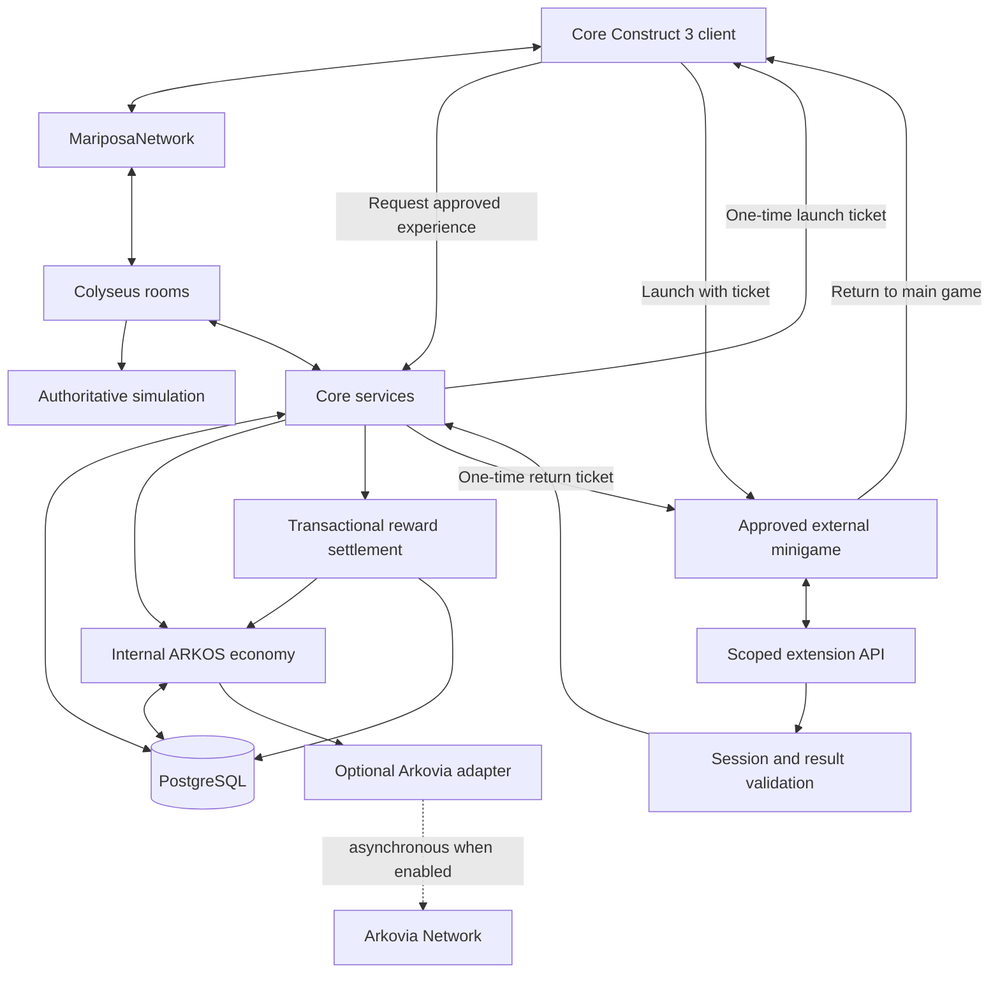
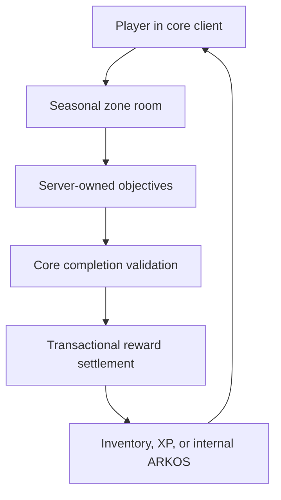
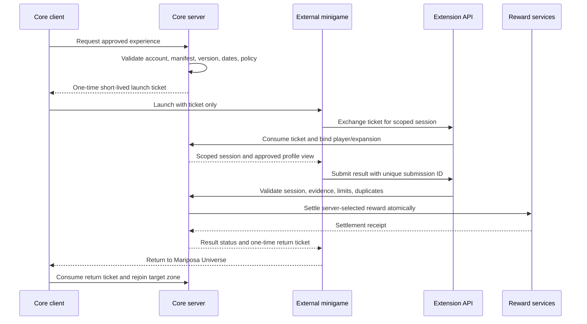
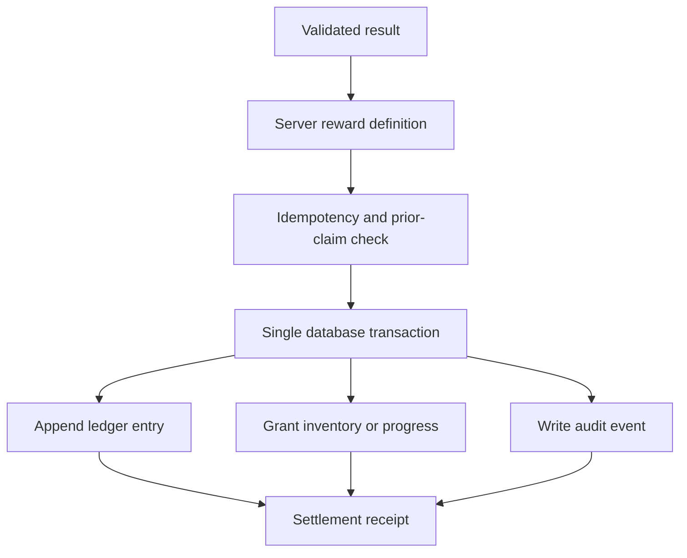

# Mariposa Universe architecture

Mariposa Universe uses a server-authoritative modular architecture. Construct 3 renders the world and sends player intentions. The backend owns identity, movement, persistence, inventory, rewards, ARKOS, NPC state, and world state.

This document distinguishes the **implemented foundation** from the **planned extension architecture**. Planned boxes are design commitments, not claims that those services already exist.

## 1. Approved high-level design



This is the approved combined overview for the core runtime and external-minigame lifecycle. The launch ticket returns to the core client first; the server does not independently push it into an external program. The minigame then exchanges that authority through the scoped extension API.

Redis is intentionally absent from this milestone diagram. It is an optional future coordination dependency for multi-worker deployments and never participates in permanent balances, inventory ownership, launch authority, or reward settlement.

### Implemented now

- Construct-specific networking bridge
- Colyseus `development_test_zone`
- Server-issued development identities
- Authoritative movement, gravity, jump, floor, and boundaries
- PostgreSQL schema and migration foundation
- Economy, seasonal, world, NPC, inventory, and platform interfaces
- Input validation, sequence checks, rate limiting, and structured logs

### Planned core services

- Production accounts and authenticated sessions
- Reconnectable player sessions
- Persistent characters and inventory
- Zone transfers and instance allocation
- NPC simulation and persistence
- Quest, housing, business, trade, and marketplace services
- Durable transactional ARKOS ledger

The first production stages remain a modular monolith. The boxes above are module boundaries; they do not require separate network processes.

## 2. World and instance model

```text
World → Region → Zone → Instance
```

- `ZoneManager` resolves zone metadata and availability.
- `InstanceAllocator` chooses or creates an appropriate room instance.
- `PlayerTransferService` prepares short-lived, one-use transfers between rooms.
- A room owns live simulation for its players and entities.
- PostgreSQL owns durable state; a room does not become the permanent database.

Seasonal locations can use the same hierarchy:

```text
Mariposa Universe
└── Winter Festival Region
    ├── Snowfall Village
    ├── Winter Race #1
    ├── Winter Race #2
    └── Snowball Arena #1
```

Disabling a seasonal region must not invalidate permanent characters, balances, inventory, or main-world access.

## 3. Extension types are intentionally different

The earlier design incorrectly routed every extension through one add-on gateway. Each extension class needs a different lifecycle and trust boundary.

| Extension type | Runs where | Installation/launch path | Authority |
|---|---|---|---|
| Native seasonal content | Core rooms and services | Registered and activated by operators | Core server is fully authoritative |
| External first-party minigame | Separate Construct 3 client plus approved server worker or result API | One-time launch ticket | Server worker or core validation is authoritative |
| Creator minigame | Separate Construct 3 project using the future SDK | Approved manifest and scoped launch ticket | Claims are untrusted until core validation |
| Data content pack/mod | Imported into controlled tools and validated before activation | Signed/versioned package import | Core runtime interprets validated data |
| Trusted backend plugin | Installed by Mariposa operators | Reviewed server deployment | May call only approved internal interfaces |
| Client presentation pack | Client asset/configuration loader | Signed package and compatibility check | No gameplay or persistence authority |

Unknown player-supplied code is never executed inside the core server. “Mod support” means controlled data packages or reviewed code—not unrestricted arbitrary code execution.

## 4. Native seasonal gameplay flow

Native events are part of the main game runtime. They do not need the external extension API.



Examples include seasonal NPCs, temporary towns, quests, decorations, or platforming inside the main Construct 3 project.

## 5. External minigame launch and return flow

The core server must authorize the launch **before** the external experience receives a usable session.



### Ticket rules

- Random, unguessable, short-lived, single use
- Stored as a hash where practical
- Bound to player, character, expansion, version, and intended action
- Invalid after expiration, consumption, revocation, or account suspension
- Never contains passwords, wallet keys, database credentials, or broad bearer authority
- Exchanged server-to-server or through a tightly scoped endpoint

An expansion should receive a pseudonymous expansion-scoped player identifier unless a global public player ID is genuinely required.

## 6. Result trust levels

A checksum or publisher signature proves package identity and integrity. It does **not** prove that a submitted score is honest.

Result handling depends on reward risk:

| Trust level | Suitable use | Validation approach |
|---|---|---|
| Low-value participation | Cosmetic participation badge | Valid session, active event, one claim |
| Plausibility-checked | Small capped reward | Bounds, timing, objectives, replay protection, anomaly checks |
| Server-observed | Competitive or valuable reward | Authoritative minigame worker records result |
| Reviewed exceptional claim | Tournament/admin event | Manual review plus auditable adjustment |

High-value ARKOS, rare items, rankings, or marketplace-relevant rewards should not depend solely on a creator client reporting its own score.

## 7. Manifest and capability model

Every external experience or package has a registered manifest with:

- Expansion and developer IDs
- Extension type
- Version and API version
- Minimum/maximum supported game versions
- Requested capabilities
- Start/end dates where applicable
- Allowed endpoints and redirect targets
- Package checksum and publisher signature
- Approval state: pending, approved, suspended, or revoked
- Distribution/platform restrictions
- Reward policy identifier

Capabilities are deny-by-default. Planned creator-facing capabilities include:

- `read_display_name`
- `read_appearance`
- `read_public_character_metadata`
- `start_session`
- `submit_score`
- `submit_completion`
- `request_reward_evaluation`
- `request_return_transfer`

No creator-facing capability permits direct balance writes, arbitrary item creation, raw database access, account administration, or arbitrary server code execution.

## 8. Reward settlement



The database transaction must either complete the whole approved reward or complete none of it. The extension receives a receipt/status, not economy or inventory write access.

## 9. Data packs and mods

Data-only mods do not call the runtime extension API. They enter through an operator-controlled import pipeline:

1. Upload to a quarantine/review area.
2. Verify publisher, checksum, signature, size, and file types.
3. Validate JSON/data schemas and references.
4. Scan archives and reject executable or unexpected content.
5. Validate game/API compatibility.
6. Review balance, safety, family-friendly content, and intellectual-property status.
7. Publish an immutable approved version.
8. Activate it through configuration with a rollback target.

Maps, dialogue, item definitions, quests, and cosmetics remain data interpreted by trusted core code.

## 10. Trusted backend plugins

Backend plugins are operational deployments, not player-uploaded mods. They are reviewed, installed, configured, and rolled back by Mariposa operators.

They use versioned internal interfaces and dependency injection. A plugin declares required services and fails startup if its contracts are incompatible. Sensitive actions still pass through authoritative services, database transactions, validation, and audit logging.

If third-party executable backend plugins are ever allowed, they should run out of process with operating-system/container isolation and a narrow authenticated API—not inside the main game process.

## 11. Creator SDK boundary

Approved creators receive a separate SDK and example Construct 3 project. They do not receive:

- Core `.c3p` project or event sheets
- Server source or internal plugin interfaces
- Database credentials
- Economy/inventory write access
- Administrative APIs
- Private server credentials
- ARKOS, treasury, wallet, or signing keys

The SDK is a client for the scoped extension API; it is not a privileged server SDK.

## 12. Platform and ARKOS separation

All gameplay economy calls the internal economy interface. The optional Arkovia adapter runs behind that interface and is not part of movement, zones, minigames, or reward validation.

Steam mode disables external-wallet and blockchain capabilities server-side. An expansion manifest cannot re-enable a platform capability prohibited by server policy.

## 13. Failure and revocation behavior

If an add-on is offline, expired, incompatible, suspended, or revoked:

- Permanent zones remain operational.
- Core authentication, inventory, and internal ARKOS remain available.
- New launch-ticket issuance stops.
- Unused launch tickets are rejected.
- Submitted results follow a documented cutoff/closeout policy.
- Pending settlements remain idempotent and auditable.
- Return-to-game recovery does not depend on the add-on remaining online.

The core client must always provide a safe route back if an external experience fails to complete its normal return flow.

## 14. Scaling direction

1. One modular Node.js server and PostgreSQL
2. Multiple Colyseus workers with Redis coordination
3. Region/world clusters with allocated zone ownership
4. Separate authoritative minigame workers where demand or reward risk requires them
5. Geographic deployments with explicit home-region and transfer rules

PostgreSQL remains the transactional authority. Redis supports ephemeral presence, coordination, caches, distributed rate limits, and pub/sub; it does not become the permanent balance or ownership store.
