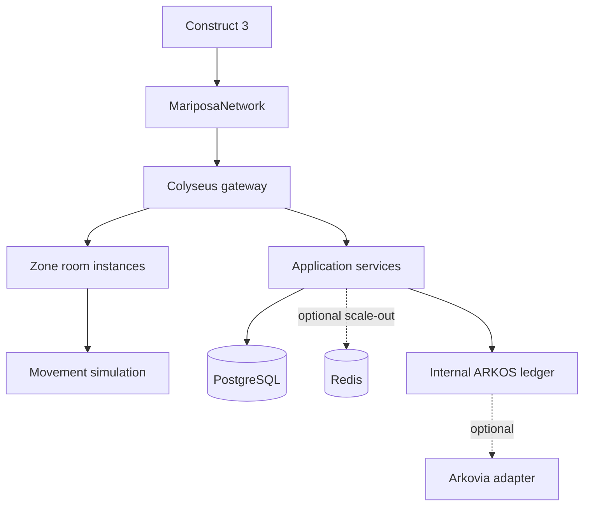

# Architecture

The application is a modular monolith. Real-time rooms, identity, world, economy, seasonal, inventory, NPC, database, security, and platform policy have explicit boundaries without premature networked microservices.

World addresses are `World → Region → Zone → Instance`. A `ZoneManager` owns metadata, an `InstanceAllocator` chooses a room, and `PlayerTransferService` will create short-lived one-use transfers after persistence is implemented. Rooms never become one giant world.

The simulation is deterministic enough for this milestone: fixed constants, no engine physics, floor plus horizontal boundaries, 60 Hz simulation, and Colyseus state patches. Future platforms should be represented as static collision data and processed server-side.

Scaling path: (1) one server plus PostgreSQL; (2) multiple workers, Redis presence/pub-sub, process-aware room allocation; (3) region/world clusters with ownership per zone; (4) geographic deployments with home-region accounts and carefully bounded cross-region transfer. PostgreSQL remains the transactional authority; replicas serve read-heavy views.
